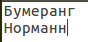
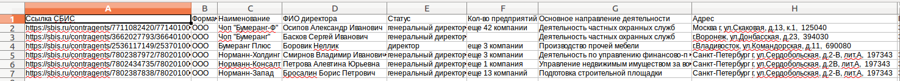
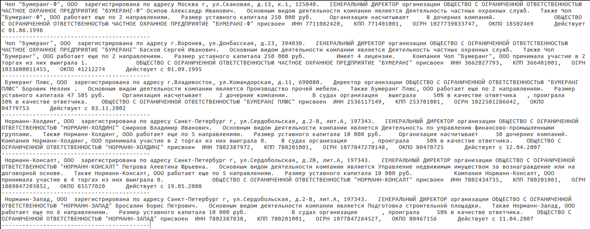
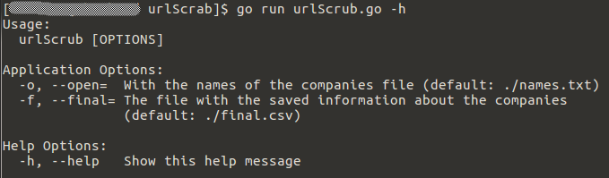

[](https://travis-ci.org/dreddsa5dies/urlScrub) [](https://goreportcard.com/report/github.com/dreddsa5dies/urlScrub) [](https://godoc.org/github.com/dreddsa5dies/urlScrub) [](https://circleci.com/gh/dreddsa5dies/urlScrub) [[!MIT License](https://img.shields.io/badge/License-MIT-blue.svg?style=shield)](https://github.com/dreddsa5dies/urlScrub/LICENSE.md)   


### urlScrub, программа для поиска данных о компаниях на [СБИС](http://sbis.ru)

## Features
* Поиск и запись данных о компаниях

## Input data
* names.txt  


## Output data
* ./reports/final.csv - Tab delimiter  

* ./reports/reports.txt  


## Demo


### Usage

```
local> urlScrub

```

## License
This project is licensed under MIT license. Please read the LICENSE file.


## Contribute
Welcomes any kind of contribution, please follow the next steps:

- Fork the project on github.com.
- Create a new branch.
- Commit changes to the new branch.
- Send a pull request.
